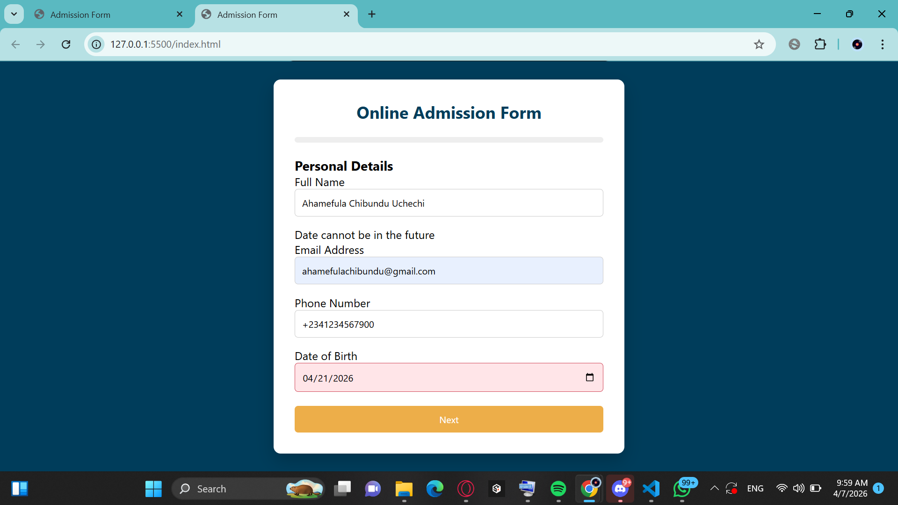
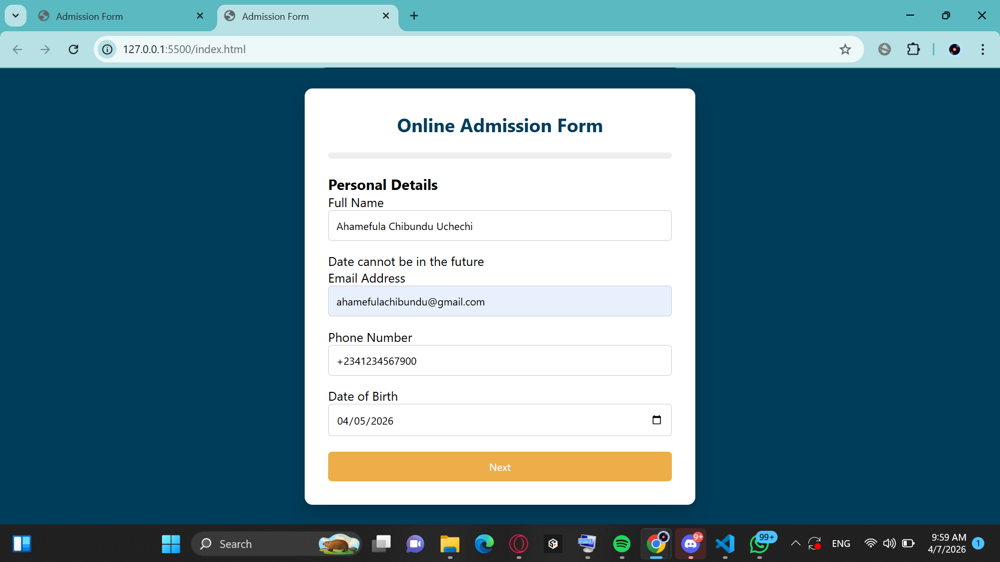
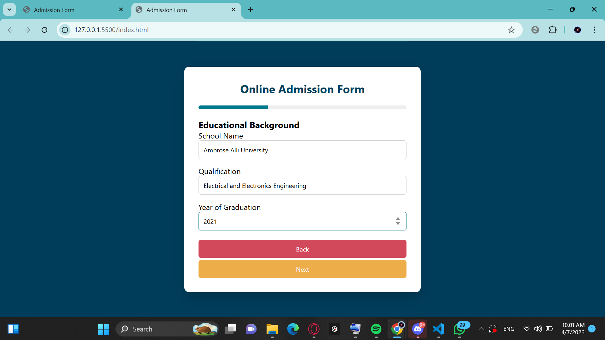
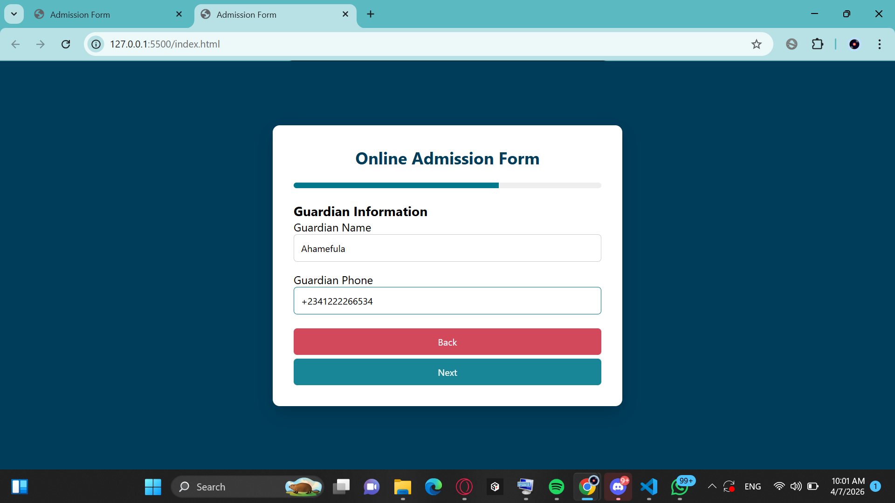
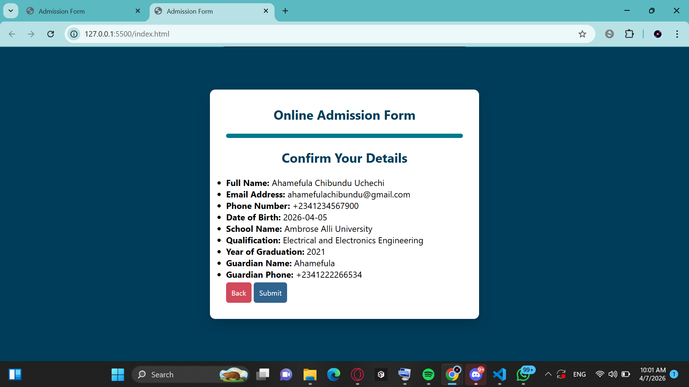

# 🎓 Online Admission Form

##  Project Description
This project is a multi-step online admission form designed to simulate a real-world student application system. It allows users to enter personal details, educational background, and guardian information in a structured and user-friendly way.

---

##  Project Goal
To design a multi-step admission form with:
- Client-side validation
- Local storage for temporary data saving
- User-friendly navigation and feedback

---

##  Target Audience
Prospective students applying for admission.

---

##  Features

- Multi-step form navigation (Next & Back)
- Sections:
  - Personal Details
  - Educational Background
  - Guardian Information
- Progress bar indicator
- Confirmation summary page
- Form validation using JavaScript
- Phone number restriction (only numbers and +)
- Date of Birth validation (no future dates)
- Local storage auto-save
- Responsive design (mobile-friendly)

---

##  Technologies Used

- HTML
- CSS
- JavaScript (Vanilla JS)
- Local Storage API

---

##  Screenshots

### Personal Details

### Education Info

### Guardian Info

### Confirmation Page

---

##  Presentation Slides

[View Presentation]()

---

##  Colour Palette

[Color palette used](https://coolors.co/palette/edae49-d1495b-00798c-30638e-003d5b)

---

##  Live Project Link

[Live project link](https://chizapplicationportal.netlify.app/)

---

##  How to Run the Project

1. Clone the repository:

2. Open `index.html` in your browser.

---

##  Future Improvements

- Backend integration for real submissions
- File upload support
- Email confirmation system
- Dashboard for admins

---

##  Author

Ahamefula Chibundu Uchechi